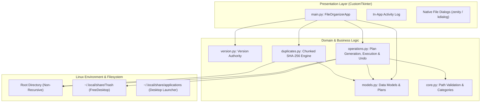

# File Suite


-FCC624?style=for-the-badge&logo=linux&logoColor=black)


A small, serious, carefully engineered Linux desktop utility for organizing loose files and finding byte-identical duplicates inside a selected directory.

File Suite is designed around defensive filesystem practices: **preview before mutation, explicit user confirmation, and deterministic collision safety**. It operates locally on loose files within the chosen target folder without descending into nested subdirectories or modifying hidden files.

<p align="center">
  
  <br/>
  
  <br/>
  
</p>

---

## Features

- **Dry-Run Preview Workflow**:
  Inspect proposed moves before touching disk. The preview displays affected file counts, total size in MB, destination subfolders, and flags any collision renames in advance.
- **Session-Based Undo**:
  Restore organized or isolated files back to their original root locations in reverse execution order. Collision detection prevents overwriting files that may have been created at the root after the move.
- **Deterministic Duplicate Manager**:
  - Stable, case-insensitive lexicographic sorting guarantees that the default "original" preserved copy is identical regardless of filesystem directory iteration order.
  - Group-by-group card view displaying SHA-256 digest prefixes and file byte sizes.
  - Selection controls ("Keep Originals Only", "Select All Duplicates", "Clear Selection").
  - Physical disk space calculation accounting for shared hard links (avoiding duplicate block overcounting).
  - Choice of isolation into a `Duplicates/` folder (undoable) or sending to system trash.
- **Defensive Filesystem Safety**:
  - **Symlink Protection**: Symlinks are strictly skipped to prevent directory traversal or remote target mutation.
  - **Destination Containment Hardening**: Destination paths and intermediate components are re-resolved immediately before execution to reject symlinks injected after the preview phase.
  - **Collision Avoidance**: Multi-part extensions are preserved cleanly (`archive_1.tar.gz`). Existing broken symlinks at destination paths are treated as occupied.
  - **Path Traversal Defense**: User-supplied destination folder names are sanitized against directory traversal attacks (`/`, `\`, `..`, control characters).
  - **Trash Transaction Rollback**: If moving a file to FreeDesktop trash fails, orphaned `.trashinfo` metadata is automatically cleaned up.
- **Responsive Background Scanning**:
  Duplicate scanning runs cooperatively on background threads with chunked 64 KB SHA-256 hashing, live progress feedback, and instant cancellation.
- **Diagnostics & Activity Log**:
  In-app viewer and CLI console logging with timestamped records for auditing operational outcomes and debugging fallbacks.
- **Native Desktop Integration**:
  Auto-detects and uses native desktop dialogs (`zenity` on GTK/GNOME, `kdialog` on KDE) with graceful fallback to Tkinter.

---

## Architecture

File Suite maintains strict separation between the presentation layer, domain logic, and filesystem storage:



### Module Responsibilities

| Module | Responsibility |
| :--- | :--- |
| `version.py` | Single source of truth for application versioning. |
| `core.py` | Pure path validation, category mappings, and collision-safe renaming. |
| `models.py` | Typed dataclasses for operation plans, items, execution results, duplicate groups, and scan progress. |
| `operations.py` | Dry-run plan building, TOCTOU containment validation, moves, FreeDesktop trash, and session undo. |
| `duplicates.py` | Size grouping, chunked SHA-256 hashing, deterministic sorting, and cooperative cancellation. |
| `main.py` | Restrained CustomTkinter graphite UI, view router, live progress metrics, and diagnostics. |

---

## Safety Model

File Suite enforces deterministic constraints before and during execution:

1. **Non-Recursive Boundary**: Operations apply exclusively to loose files directly inside the active directory. Subdirectories are never descended into, altered, or deleted.
2. **Pre-Execution Revalidation**: The dry-run preview and execution phases maintain separate trust boundaries. Source file existence, regular file type, and non-symlink status are verified again immediately prior to each move.
3. **Destination Path Containment**: Every target path is checked against the active root directory. If an intermediate directory was replaced by a symbolic link between preview and execution, the operation is aborted for that item.
4. **Collision Avoidance**: Target names that collide with existing files or symlinks are suffixed (`file_1.pdf`, `archive_1.tar.gz`) without overwriting existing data.
5. **Path Traversal Defense**: User-supplied folder names cannot escape the root boundary (`/`, `\`, `..`, leading `~`, and control characters are rejected).
6. **FreeDesktop Trash Specification**: Files sent to trash are moved into `~/.local/share/Trash/files` with conforming `.trashinfo` metadata. If the physical move fails, the metadata file is removed to prevent orphaned trash entries.

---

## Limitations

For transparency and engineering clarity:

- **Linux Platform**: File Suite is tailored for Linux desktop environments (X11 and Wayland) and adheres to XDG and FreeDesktop standards.
- **Race-Condition Surface**: While File Suite performs strict pre-execution revalidation, standard OS filesystem abstractions cannot guarantee absolute race-condition immunity against concurrent malicious processes running in the same directory.
- **Hard Links**: Duplicate size metrics account for shared inodes so physical disk blocks are not overcounted. Deleting a hard-linked duplicate removes that directory entry and decrements the inode link count, but only frees physical disk blocks when the last link is unlinked.
- **Session-Based Undo**: Undo is tracked in-memory for the current application session. Files sent to system trash must be restored via your desktop file manager's trash interface.

---

## Requirements

- **Operating System**: Linux (X11 or Wayland)
- **Python**: 3.10, 3.11, 3.12, or 3.13
- **Tkinter**: `python3-tk` (installed via system package manager if not present by default)

*Optional dependencies for native folder pickers:*
- `zenity` (GNOME, Cinnamon, XFCE)
- `kdialog` (KDE Plasma)

---

## Installation & Usage

### Running from Source (Development)

```bash
git clone https://github.com/teppe21/File-Suite.git
cd File-Suite

# Set up virtual environment
python3 -m venv .venv
source .venv/bin/activate

# Install dependencies
pip install --upgrade pip
pip install -r requirements.txt

# Launch application
python3 main.py
```

### Building a Standalone Executable

File Suite can be compiled into a single self-contained binary using PyInstaller. The included `build.sh` script automates environment isolation, packaging, and SHA-256 checksum generation:

```bash
chmod +x build.sh
./build.sh
```

This generates `dist/FileSuite` and `dist/FileSuite.sha256`.

### Installing to User Desktop

To install the application into your local desktop environment (`~/.local/bin` and desktop launcher):

```bash
chmod +x install.sh
./install.sh
```

File Suite will appear in your application launcher (under System/Utilities) and can also be launched directly via `FileSuite` in your terminal.

---

## Testing & Quality Assurance

The repository includes a headless unit test suite covering path safety, operation plans, collision handling, duplicate hashing, and undo semantics:

```bash
# Run all 58 unit tests
python3 -m unittest discover -s tests -v

# Run Ruff linter
ruff check .

# Run Bandit security analysis
bandit -c pyproject.toml -r .
```

### Continuous Integration

Every push and pull request is validated through GitHub Actions across:
- **Linting**: Ruff (PEP 8, Bugbear, Flake8, Pyupgrade).
- **Security**: Bandit AST vulnerability scanner.
- **Matrix Testing**: Python `3.10`, `3.11`, `3.12`, and `3.13`.
- **Packaging**: Automated PyInstaller executable build and SHA-256 verification.

---

## Releases

Releases are published automatically via GitHub Actions whenever a version tag (e.g. `v1.1.1`) is pushed:

1. Runs complete lint, security, and unit test suites.
2. Compiles standalone Linux binary via `build.sh`.
3. Verifies SHA-256 checksums.
4. Creates a GitHub Release with attached executable and checksum assets.

---

## Project Structure

```
File-Suite/
├── .github/
│   └── workflows/
│       ├── release.yml      # Tag-triggered release workflow
│       └── tests.yml        # CI test matrix (3.10-3.13), Ruff & Bandit validation
├── .gitignore               # Security-hardened gitignore
├── CHANGELOG.md             # Semantic release history (Keep a Changelog)
├── LICENSE                  # MIT License
├── README.md                # Project documentation and architecture guide
├── build.sh                 # PyInstaller standalone build script
├── core.py                  # Path validation, category maps, collision renaming
├── duplicates.py            # Background chunked SHA-256 duplicate scan engine
├── install.sh               # XDG user-local desktop integration installer
├── main.py                  # CustomTkinter graphite UI, view router & event loop
├── models.py                # Dataclasses: plans, items, results, groups, progress
├── operations.py            # Plan creation, dry-run preview, containment checks, undo
├── organizer.jpg            # Application desktop icon
├── pyproject.toml           # Ruff and Bandit linter configuration
├── requirements.txt         # Runtime dependencies
├── version.py               # Single source of truth for versioning
└── tests/
    ├── test_core.py         # Path validation & renaming tests (21 tests)
    ├── test_duplicates.py   # Hashing, deterministic order, hardlink tests (11 tests)
    ├── test_models.py       # Dataclass & metric calculation tests (5 tests)
    ├── test_operations.py   # Move execution, containment, symlink, trash tests (18 tests)
    └── test_version.py      # Version consistency and wiring tests (3 tests)
```

---

## License

Distributed under the MIT License. See [LICENSE](LICENSE) for details.
