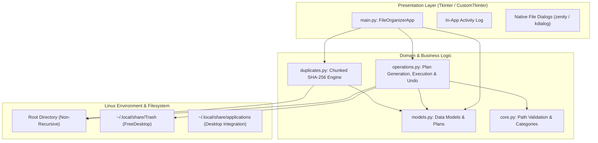

# File Suite


-FCC624?style=for-the-badge&logo=linux&logoColor=black)


A robust, portfolio-ready Linux desktop utility for organizing files and finding byte-identical duplicates inside a selected directory.

File Suite is built around a strict safety philosophy: **preview before mutation, zero data loss, and explicit user control**. It operates deterministically on loose files in the chosen target folder without descending into nested subdirectories or modifying hidden files.


---

## Key Features

- **Dry-Run Preview Workflow**:
  Inspect proposed moves before touching disk. The preview displays affected file counts, total size in MB, destination subfolders, and flags any collision renames in advance.
- **Session-Based Undo**:
  Made a mistake? One click restores all moved files back to their original root locations. Safe collision checks ensure newly created files at the root are never overwritten during undo.
- **Structured Duplicate Manager**:
  Group-by-group card view displaying SHA-256 digest prefixes and per-file byte sizes. Includes one-click presets like "Keep Originals Only" or "Select All Duplicates", with options to either isolate copies into a `Duplicates/` folder (undoable) or move them to system trash.
- **Engineered Filesystem Safety**:
  - **Symlink Protection**: Symlinks are strictly skipped to prevent unintended directory traversal, circular loops, or remote target deletion.
  - **TOCTOU Resilience**: Files are re-validated immediately before moving to prevent race conditions.
  - **Collision Avoidance**: Existing files are never overwritten; multi-part extensions are preserved cleanly (`archive_1.tar.gz`).
  - **Path Traversal Prevention**: Custom folder names are strictly sanitized against directory traversal attacks (`../`, absolute paths, control characters).
- **Zero-Latency UI & Background Workers**:
  Duplicate scanning runs cooperatively on background threads with chunked 64 KB SHA-256 hashing. Large file sets stay responsive with live progress metrics and instant cancellation.
- **Diagnostics & Activity Log**:
  Built-in terminal and GUI log viewer recording timestamped operational records, errors, and fallback events.
- **Native Desktop Integration**:
  Auto-detects and uses native desktop dialogs (`zenity` on GTK/GNOME, `kdialog` on KDE) with graceful fallback to Tkinter.

---

## Architecture

File Suite is designed with strict separation between user interface and underlying business logic:



### Module Responsibilities

| Module | Responsibility |
| :--- | :--- |
| `core.py` | Path validation, category extension dictionaries, and collision-safe renaming. |
| `models.py` | Immutable data structures (`OperationPlan`, `OperationItem`, `DuplicateGroup`, etc.). |
| `operations.py` | Dry-run plan computation, atomic moves, collision resolution, FreeDesktop trash, and session undo. |
| `duplicates.py` | Size pre-filtering, 64 KB chunked SHA-256 hashing, and cooperative cancellation. |
| `main.py` | Restrained graphite/slate dark UI, view routing, progress bars, and diagnostics. |

---

## Safety Model

File Suite is engineered for predictable, non-destructive operation:

1. **Non-Recursive Scope**: Operations are strictly restricted to the files located directly inside the active directory. Subfolders are never entered or mutated.
2. **Symlink Isolation**: Symlinks are never followed, moved, or deleted (`os.path.islink()` validation).
3. **Hidden File Exclusion**: Hidden files and dotfiles (e.g., `.gitignore`, `.bashrc`) are skipped by default.
4. **Collision Protection**: In case of a naming conflict at destination, files are dynamically suffixed (`file_1.pdf`, `archive_1.tar.gz`) without overwriting existing data.
5. **Path Traversal Defense**: User-supplied folder names cannot escape the root boundary. Characters like `/`, `\`, `..`, and control characters are rejected.
6. **FreeDesktop Trash Support**: Trashed files are moved into `~/.local/share/Trash/files` accompanied by standard `.trashinfo` metadata files conforming to the FreeDesktop.org Trash Specification.

---

## Requirements

- **Operating System**: Linux (X11 or Wayland)
- **Python**: 3.10, 3.11, 3.12, or 3.13
- **Tkinter**: `python3-tk` (installed via system package manager if not present by default)

*Optional dependencies for native folder pickers:*
- `zenity` (GNOME, Cinnamon, XFCE)
- `kdialog` (KDE Plasma)

---

## Installation & Usage

### Running from Source (Development)

```bash
git clone https://github.com/teppe21/File-Suite.git
cd File-Suite

# Set up virtual environment
python3 -m venv .venv
source .venv/bin/activate

# Install dependencies
pip install --upgrade pip
pip install -r requirements.txt

# Launch application
python3 main.py
```

### Building a Standalone Executable

File Suite can be compiled into a single self-contained binary using PyInstaller. The included `build.sh` script automates environment isolation, packaging, and SHA-256 checksum generation:

```bash
chmod +x build.sh
./build.sh
```

This generates `dist/FileSuite` and `dist/FileSuite.sha256`.

### Installing to User Desktop

To install the application into your local desktop environment (`~/.local/bin` and desktop launcher):

```bash
chmod +x install.sh
./install.sh
```

Once installed, File Suite will appear in your application launcher (under System/Utilities) and can also be launched directly via `FileSuite` in your terminal.

---

## Testing & Quality Assurance

The project includes a comprehensive headless unit test suite covering path safety, operation plans, collision handling, duplicate hashing, and undo semantics:

```bash
# Run all 42 unit tests
python3 -m unittest discover -s tests -v

# Run Ruff linter and Bandit security checks
ruff check .
```

### Continuous Integration

Every push and pull request is validated through GitHub Actions across:
- **Linting**: Ruff (PEP 8, Bugbear, Flake8, and Bandit security analysis).
- **Matrix Testing**: Python `3.10`, `3.11`, `3.12`, and `3.13`.
- **Packaging**: Automated PyInstaller executable build and SHA-256 verification.

---

## Project Structure

```
File-Suite/
├── .github/
│   └── workflows/
│       └── tests.yml        # CI test matrix (3.10-3.13), Ruff & build validation
├── .gitignore               # Security-hardened gitignore
├── CHANGELOG.md             # Semantic release history (Keep a Changelog)
├── LICENSE                  # MIT License
├── README.md                # Project documentation and architecture guide
├── build.sh                 # PyInstaller standalone build script
├── core.py                  # Path validation, category maps, collision renaming
├── duplicates.py            # Background chunked SHA-256 duplicate scan engine
├── install.sh               # XDG user-local desktop integration installer
├── main.py                  # CustomTkinter graphite UI, view router & event loop
├── models.py                # Dataclasses: plans, items, results, groups, progress
├── operations.py            # Plan creation, dry-run preview, atomic moves, undo
├── organizer.jpg            # Application desktop icon
├── pyproject.toml           # Ruff and Bandit linter configuration
├── requirements.txt         # Runtime dependencies
└── tests/
    ├── test_core.py         # Path validation & renaming tests (21 tests)
    ├── test_duplicates.py   # Chunked hashing & cancellation tests (6 tests)
    ├── test_models.py       # Dataclass & metric calculation tests (5 tests)
    └── test_operations.py   # Dry-run, move execution, TOCTOU & undo tests (10 tests)
```

---

## License

Distributed under the MIT License. See [LICENSE](LICENSE) for details.
